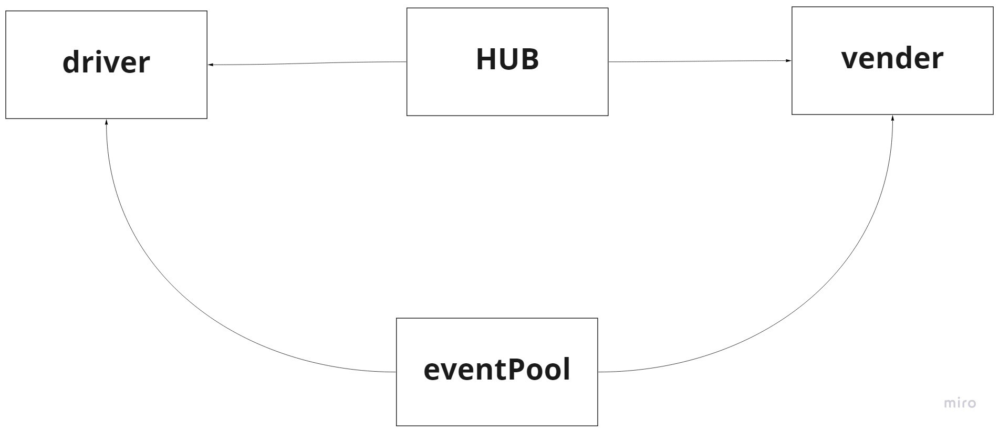
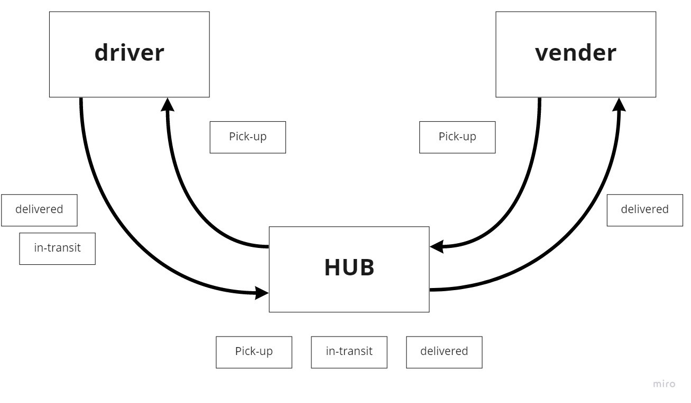

# CAPS
Created by Bryce Pfingston  

## Installation  
npm i { jest, supertest, faker}  
  
## Summary of Problem Domain  
Begin the build of an application for a company called CAPS - The Code Academy Parcel Service. In this sprint, we’ll build out a system that emulates a real world supply chain. CAPS will simulate a delivery service where vendors (such a flower shops) will ship products using our delivery service and when our drivers deliver them, be notified that their customers received what they purchased. 

## Links to application deployment  
 
Githut: https://github.com/bpfingston/caps
  
## Include embedded UML

## Talk about your routes

routes:
    - SignIn:
        - validate user
        - HTTP POST
    - SignUp:
        - Create a new Username and Password
        - HTTP POST
    - Secret
        - Its a secret, can you keep it?
        - HTTP GET
    - Users
        - permissions for individual users.
        - HTTP GET
